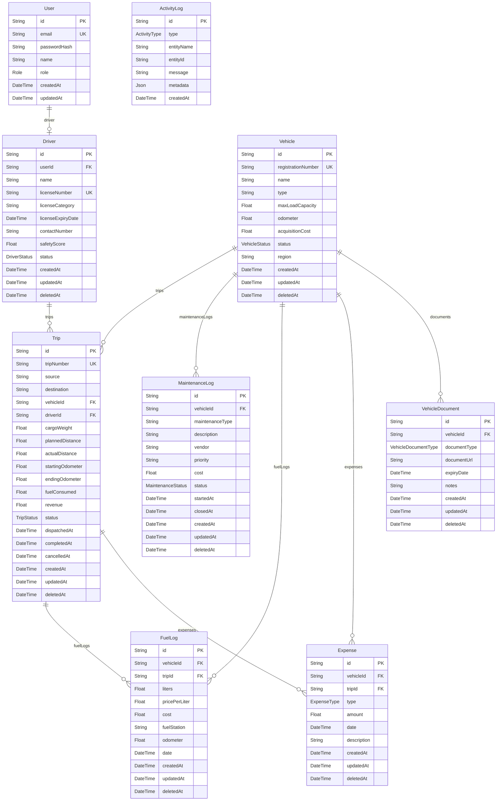

# TransitOps – Smart Transport Operations Platform

## Project Overview

Build a full-stack web application called **TransitOps**, a transport operations management platform that helps logistics companies manage vehicles, drivers, trips, maintenance, fuel, expenses, and operational analytics.

The application should digitize the entire transport workflow and enforce all business rules automatically.

---

## User Roles

Implement Role-Based Access Control (RBAC) with the following roles:

* Fleet Manager
* Driver
* Safety Officer
* Financial Analyst

Only authenticated users can access the application.
Different roles should have different permissions.

---

## Authentication

Implement:

* Login using email and password
* JWT authentication (or session authentication)
* Protected routes
* Role-based authorization

---

## Dashboard

Create a dashboard displaying:

* Total Vehicles
* Active Vehicles
* Available Vehicles
* Vehicles in Maintenance
* Active Trips
* Pending Trips
* Drivers On Duty
* Fleet Utilization (%)

Allow filtering by:

* Vehicle Type
* Vehicle Status
* Region

---

## Vehicle Management

Implement complete CRUD for vehicles.

Each vehicle contains:

* Registration Number (must be unique)
* Vehicle Name / Model
* Vehicle Type
* Maximum Load Capacity
* Odometer
* Acquisition Cost
* Region
* Status

Vehicle Status:

* Available
* On Trip
* In Shop
* Retired

Retired vehicles cannot be dispatched.
Vehicles under maintenance cannot be dispatched.

---

## Driver Management

Implement CRUD for drivers.

Each driver contains:

* Name
* License Number (unique)
* License Category
* License Expiry Date
* Contact Number
* Safety Score
* Status

Driver Status:

* Available
* On Trip
* Off Duty
* Suspended

Drivers with expired licenses cannot be assigned to trips.
Suspended drivers cannot be assigned to trips.

---

## Trip Management

Allow creating transport trips.

Each trip contains:

* Source
* Destination
* Assigned Vehicle
* Assigned Driver
* Cargo Weight
* Planned Distance
* Actual Distance
* Revenue
* Starting Odometer
* Ending Odometer
* Fuel Consumed

Trip lifecycle:

Draft → Dispatched → Completed (or Cancelled)

Implement all status transitions automatically.

---

## Maintenance Management

Implement vehicle maintenance records.

Each maintenance record contains:

* Vehicle
* Maintenance Type
* Description
* Vendor
* Cost
* Priority
* Status

Status:

* Active
* Closed

When maintenance becomes Active:
* Vehicle status automatically changes to "In Shop"

When maintenance closes:
* Vehicle becomes Available (unless retired)

---

## Fuel Management

Implement fuel logs.

Each fuel log contains:

* Vehicle
* Optional Trip
* Liters
* Cost
* Price per Liter
* Fuel Station
* Odometer
* Date

---

## Expense Management

Implement expenses.

Expense types:

* Toll
* Maintenance
* Other

Each expense stores:

* Vehicle
* Optional Trip
* Amount
* Type
* Description
* Date

Automatically calculate operational costs.

---

## Reports & Analytics

Provide reports showing:

* Fuel Efficiency
* Fleet Utilization
* Operational Cost
* Vehicle ROI

**Fuel Efficiency**: Distance Driven / Fuel Consumed
**Vehicle ROI**: (Revenue − Fuel Cost − Maintenance Cost) / Acquisition Cost

Support CSV export.
PDF export is optional.

---

## Vehicle Documents

Allow uploading vehicle documents.

Document types:

* Registration
* Insurance
* Fitness
* Pollution
* Other

Store:

* File
* Expiry Date
* Notes

---

## Activity Logs

Track important events.

Examples:

* Vehicle Created
* Vehicle Updated
* Driver Created
* Driver Updated
* Trip Created
* Trip Dispatched
* Trip Completed
* Trip Cancelled
* Maintenance Created
* Maintenance Closed
* Fuel Log Added
* Expense Added

---

## Business Rules (Mandatory)

Implement all of the following validations:

### Vehicle

* Registration number must be unique.
* Retired vehicles cannot be dispatched.
* Vehicles in maintenance cannot be dispatched.
* Vehicles already on a trip cannot be assigned to another trip.

### Driver

* Expired licenses cannot be be assigned.
* Suspended drivers cannot be assigned.
* Drivers already on a trip cannot be assigned to another trip.

### Trip

* Cargo weight must not exceed vehicle maximum capacity.
* Dispatch automatically changes:
  * Vehicle → On Trip
  * Driver → On Trip
* Completing a trip automatically changes:
  * Vehicle → Available
  * Driver → Available
* Cancelling a dispatched trip restores:
  * Vehicle → Available
  * Driver → Available

### Maintenance

Creating maintenance: Vehicle → In Shop
Closing maintenance: Vehicle → Available

---

## Database Entities & Schema

Design the database with at least:

* Users
* Roles
* Vehicles
* Drivers
* Trips
* Maintenance Logs
* Fuel Logs
* Expenses
* Vehicle Documents
* Activity Logs

The following Entity-Relationship (ER) diagram represents the database schema for the transit-ops-odoo application, based on the Prisma schema.

---

## Dashboard Analytics

Display:

* Active Trips
* Vehicles Available
* Vehicles In Shop
* Drivers On Duty
* Fleet Utilization
* Total Fuel Cost
* Total Maintenance Cost
* Operational Cost
* ROI

---

## Bonus Features

If time permits:

* Charts using Recharts
* PDF Export
* Email reminders for expiring licenses
* Vehicle document management
* Search
* Filters
* Sorting
* Dark Mode

---

## Tech Stack

Use:

* Next.js 15 (App Router)
* TypeScript
* Tailwind CSS
* Shadcn UI
* Prisma ORM
* PostgreSQL
* NextAuth/Auth.js or JWT
* React Hook Form + Zod
* TanStack Table
* Recharts
* Server Actions where appropriate