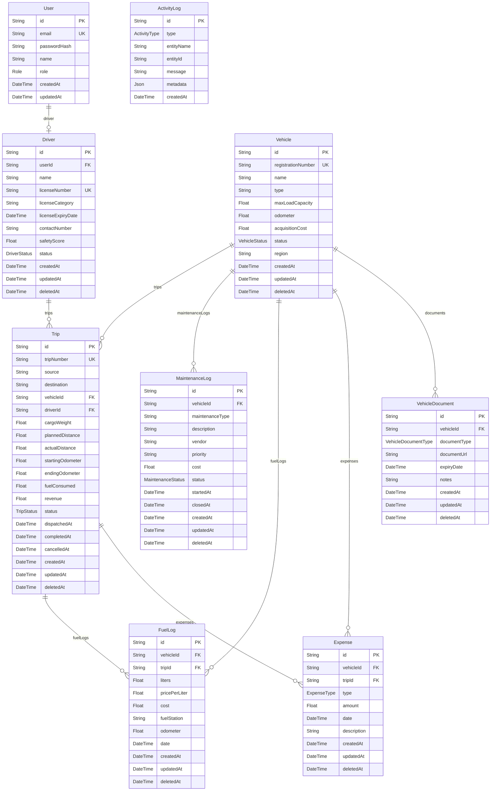

# transit-ops-odoo

## Database Schema

The following Entity-Relationship (ER) diagram represents the database schema for the transit-ops-odoo application, based on the Prisma schema.

```mermaid
erDiagram
    User ||--o| Driver : "driver"
    Vehicle ||--o{ Trip : "trips"
    Vehicle ||--o{ MaintenanceLog : "maintenanceLogs"
    Vehicle ||--o{ FuelLog : "fuelLogs"
    Vehicle ||--o{ Expense : "expenses"
    Vehicle ||--o{ VehicleDocument : "documents"
    Driver ||--o{ Trip : "trips"
    Trip ||--o{ FuelLog : "fuelLogs"
    Trip ||--o{ Expense : "expenses"

    User {
        String id PK
        String email UK
        String passwordHash
        String name
        Role role
        DateTime createdAt
        DateTime updatedAt
    }
    Vehicle {
        String id PK
        String registrationNumber UK
        String name
        String type
        Float maxLoadCapacity
        Float odometer
        Float acquisitionCost
        VehicleStatus status
        String region
        DateTime createdAt
        DateTime updatedAt
        DateTime deletedAt
    }
    Driver {
        String id PK
        String userId FK
        String name
        String licenseNumber UK
        String licenseCategory
        DateTime licenseExpiryDate
        String contactNumber
        Float safetyScore
        DriverStatus status
        DateTime createdAt
        DateTime updatedAt
        DateTime deletedAt
    }
    Trip {
        String id PK
        String tripNumber UK
        String source
        String destination
        String vehicleId FK
        String driverId FK
        Float cargoWeight
        Float plannedDistance
        Float actualDistance
        Float startingOdometer
        Float endingOdometer
        Float fuelConsumed
        Float revenue
        TripStatus status
        DateTime dispatchedAt
        DateTime completedAt
        DateTime cancelledAt
        DateTime createdAt
        DateTime updatedAt
        DateTime deletedAt
    }
    MaintenanceLog {
        String id PK
        String vehicleId FK
        String maintenanceType
        String description
        String vendor
        String priority
        Float cost
        MaintenanceStatus status
        DateTime startedAt
        DateTime closedAt
        DateTime createdAt
        DateTime updatedAt
        DateTime deletedAt
    }
    FuelLog {
        String id PK
        String vehicleId FK
        String tripId FK
        Float liters
        Float pricePerLiter
        Float cost
        String fuelStation
        Float odometer
        DateTime date
        DateTime createdAt
        DateTime updatedAt
        DateTime deletedAt
    }
    Expense {
        String id PK
        String vehicleId FK
        String tripId FK
        ExpenseType type
        Float amount
        DateTime date
        String description
        DateTime createdAt
        DateTime updatedAt
        DateTime deletedAt
    }
    VehicleDocument {
        String id PK
        String vehicleId FK
        VehicleDocumentType documentType
        String documentUrl
        DateTime expiryDate
        String notes
        DateTime createdAt
        DateTime updatedAt
        DateTime deletedAt
    }
    ActivityLog {
        String id PK
        ActivityType type
        String entityName
        String entityId
        String message
        Json metadata
        DateTime createdAt
    }
```