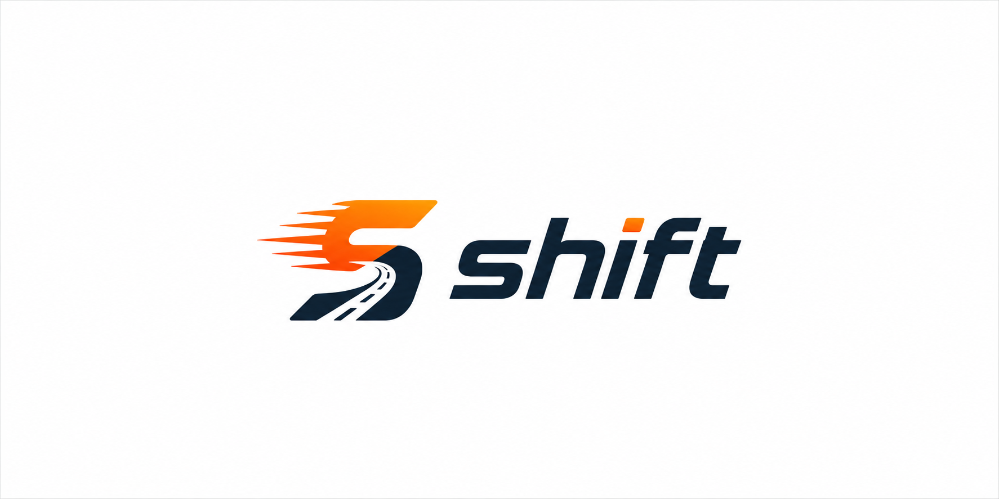
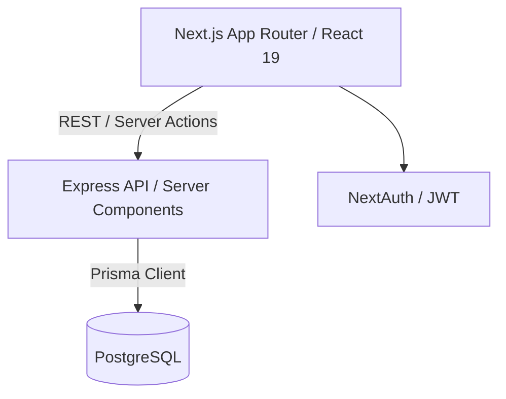
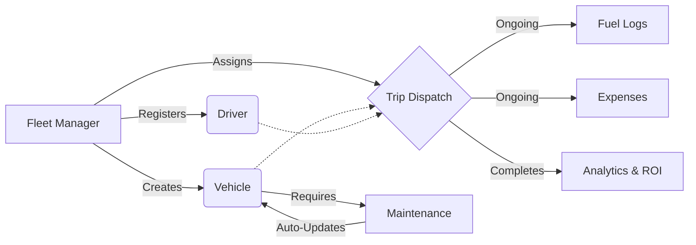
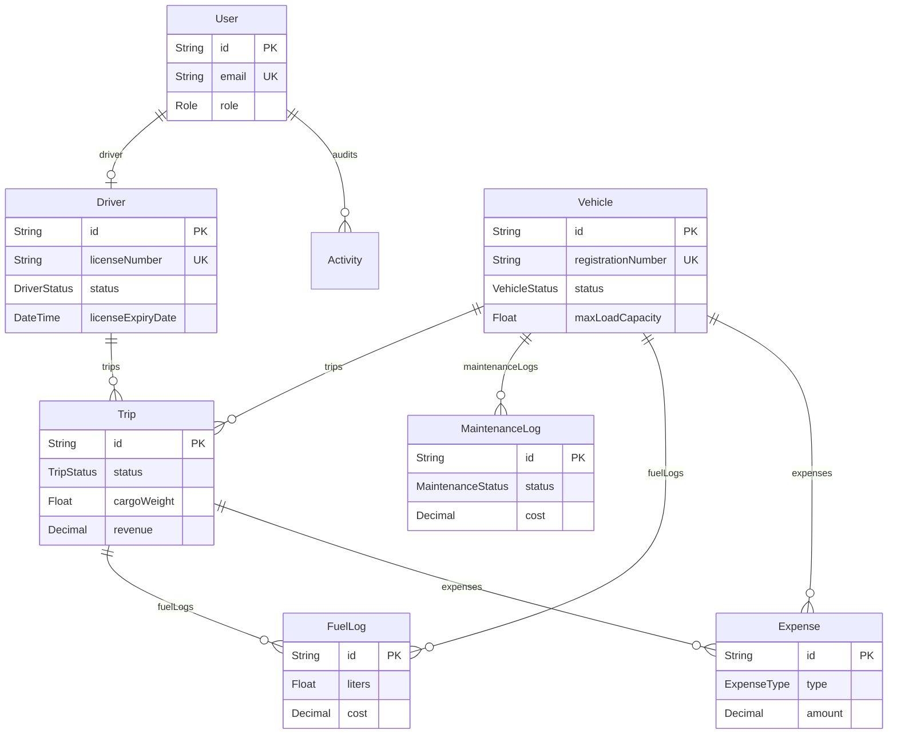
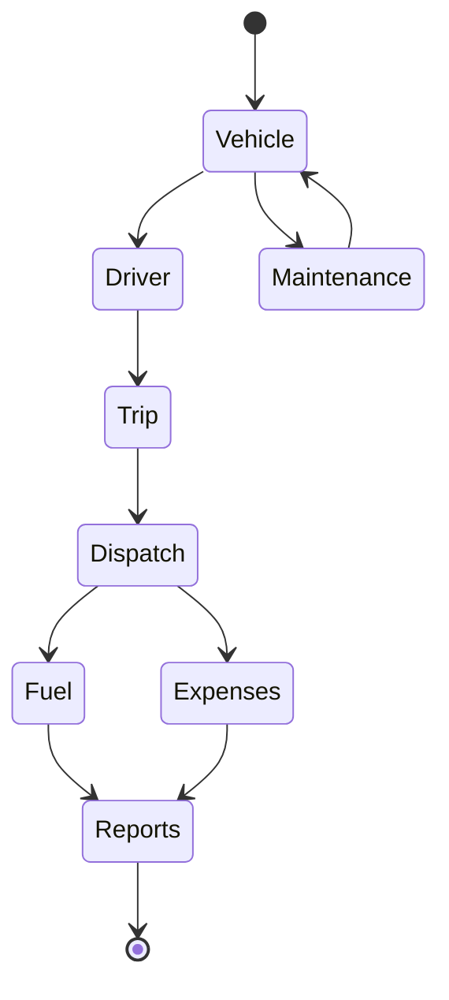

<div align="center">
  
  

  <h1>Shift</h1>
  <p><b>Modern Fleet & Transport Operations Platform</b></p>

  <p>
    
    
    
    
    
    
  </p>
</div>

---

## 📌 Overview

**The Problem:** Traditional transport management relies heavily on fragmented systems, spreadsheets, and manual communication. This leads to inefficient vehicle utilization, untracked operational costs, and compliance risks (like assigning trips to drivers with expired licenses or vehicles under maintenance).

**The Solution:** **Shift** is a comprehensive fleet management platform that digitizes the entire transportation workflow. From dispatching trips to tracking fuel and maintenance, Shift centralizes all operations into a single, real-time dashboard while automatically enforcing critical business rules.

---

## ✨ Key Features

| Area | Features |
| :--- | :--- |
| 🚛 **Vehicle Management** | Complete registry, real-time status tracking, and capacity validation. |
| 👤 **Driver Management** | Profile management, automated license expiry validation, and safety scoring. |
| 📍 **Trip Dispatch** | Automated transitions from Draft → Dispatched → Completed. |
| 🔧 **Maintenance Workflow** | Vendor tracking, cost management, and automated "In Shop" vehicle status. |
| ⛽ **Fuel Tracking** | Real-time fuel logs per trip and vehicle to monitor fuel efficiency. |
| 💸 **Expense Tracking** | Logging of tolls, maintenance, and other trip-related expenses. |
| 📊 **Analytics Dashboard** | Live KPIs for Fleet Utilization, Active Trips, and Operational ROI. |
| 📑 **Activity Logs** | Immutable audit trails for all critical entity creations and updates. |
| 🛡️ **Role-Based Auth** | Strict access control for Fleet Managers, Drivers, and Financial Analysts. |
| ⚙️ **Automatic Rules** | Built-in logic preventing dispatch of unavailable drivers or retired vehicles. |

---

## 🏗 Architecture

### System Architecture


### Flowchart


---

## 🗄 Database Design



---

## 🔄 Business Workflow



---

## 📁 Folder Structure

```text
transit-ops-odoo/
├── backend/
│   ├── prisma/             # Database schema & migrations
│   ├── src/                # Express API source code
│   └── package.json
└── frontend/
    ├── public/             # Static assets (images, logos)
    ├── src/
    │   ├── app/            # Next.js 15 App Router pages
    │   ├── components/     # Reusable React components (Shadcn UI)
    │   ├── lib/            # Utilities and configurations
    │   └── store/          # Zustand state management
    ├── tailwind.config.ts  # Tailwind CSS configuration
    └── package.json
```

---

## 🚀 Installation

### 1. Clone the repository
```bash
git clone https://github.com/your-username/transit-ops-odoo.git
cd transit-ops-odoo
```

### 2. Install dependencies
```bash
# Install backend dependencies
cd backend
npm install

# Install frontend dependencies
cd ../frontend
npm install
```

### 3. Setup Environment Variables
Duplicate `.env.example` to `.env` in both the `frontend` and `backend` directories and configure your variables.

### 4. Database Setup & Migration
```bash
cd backend
npx prisma generate
npx prisma migrate dev --name init
npx prisma db seed
```

### 5. Run the Application
Start the backend and frontend development servers.
```bash
# Terminal 1 (Backend)
cd backend
npm run dev

# Terminal 2 (Frontend)
cd frontend
npm run dev
```

---

## 🔐 Environment Variables

| Variable | Location | Description |
| :--- | :--- | :--- |
| `DATABASE_URL` | backend | Connection string for PostgreSQL (Neon/Local). |
| `DIRECT_URL` | backend | Direct connection string for Prisma migrations. |
| `JWT_SECRET` | backend | Secret key for signing JSON Web Tokens. |
| `PORT` | backend | Port for the backend API (Default: `3001`). |
| `NEXT_PUBLIC_API_URL` | frontend | URL pointing to the backend API. |

---

## ✅ Business Rules

- [x] **Unique Vehicle Registration:** Registration numbers are universally unique.
- [x] **Vehicle Dispatch Availability:** Vehicles marked as "Retired" or "In Shop" cannot be dispatched.
- [x] **Driver Dispatch Availability:** Drivers with expired licenses or "Suspended" status cannot be dispatched.
- [x] **Exclusive Assignment:** Drivers and Vehicles currently "On Trip" cannot be assigned to new concurrent trips.
- [x] **Cargo Capacity:** Cargo weight on a trip cannot exceed the assigned vehicle's maximum load capacity.
- [x] **Auto Status Transitions:** 
  - *Dispatching* a trip automatically marks the Driver and Vehicle as "On Trip".
  - *Completing* or *Canceling* a trip restores the Driver and Vehicle to "Available".
  - *Opening* maintenance marks a Vehicle as "In Shop".
  - *Closing* maintenance restores a Vehicle to "Available".

---

## 🌟 Features Showcase

<details>
<summary><b>🚛 Vehicle Registry</b></summary>
Manage the complete fleet with real-time vehicle availability. Easily track odometer readings, acquisition costs, and maintenance histories all from a single view.
</details>

<details>
<summary><b>📍 Trip Dispatch</b></summary>
Automatically validates driver status, vehicle availability, and cargo limits before dispatch. Eradicates human error in logistical assignments.
</details>

<details>
<summary><b>🔧 Predictive Maintenance</b></summary>
Automatically removes vehicles from dispatch while under maintenance. Tracks repair costs, vendors, and downtime to calculate accurate operational ROI.
</details>

<details>
<summary><b>🛡️ Activity Auditing</b></summary>
A strict, unalterable log tracking which user created or updated specific vehicles, trips, and expenses to ensure operational accountability.
</details>

---

## 📈 Analytics

The platform's dashboard provides comprehensive, real-time analytics designed for logistics optimization:

* **Fleet Utilization:** Percentage of vehicles currently on active trips vs. those sitting idle.
* **Fuel Efficiency:** Calculates distance driven divided by fuel consumed per vehicle.
* **Operational Cost:** Automatically aggregates fuel costs, maintenance bills, and tolls to provide total trip expenses.
* **Vehicle ROI:** Formula-driven insights: `(Revenue - Fuel Cost - Maintenance Cost) / Acquisition Cost`.

---

## 🛠 Tech Stack

| Category | Technologies |
| :--- | :--- |
| **Frontend Framework** | Next.js 15 (App Router), React 19 |
| **Styling & UI Components** | Tailwind CSS 4, Shadcn UI (Radix), Lucide Icons |
| **State & Forms** | Zustand, React Hook Form, Zod |
| **Data Visualization** | Recharts, TanStack Table |
| **Backend & ORM** | Express.js, Prisma ORM |
| **Database** | PostgreSQL |
| **Authentication** | NextAuth.js / JWT, bcryptjs |

---

## 🔮 Future Improvements

- [ ] Live GPS Tracking integration for active trips.
- [ ] Maps and Route Optimization APIs.
- [ ] Automated SMS/Email notifications for expiring driver licenses.
- [ ] Dedicated Driver Mobile App for uploading expense receipts.
- [ ] AI-driven Fleet Analytics for Predictive Maintenance.

---

## 👨‍💻 Contributors

Built with ❤️ during a Hackathon.

Contributions, issues, and feature requests are welcome!

---

## 📄 License

This project is [MIT](./LICENSE) licensed.